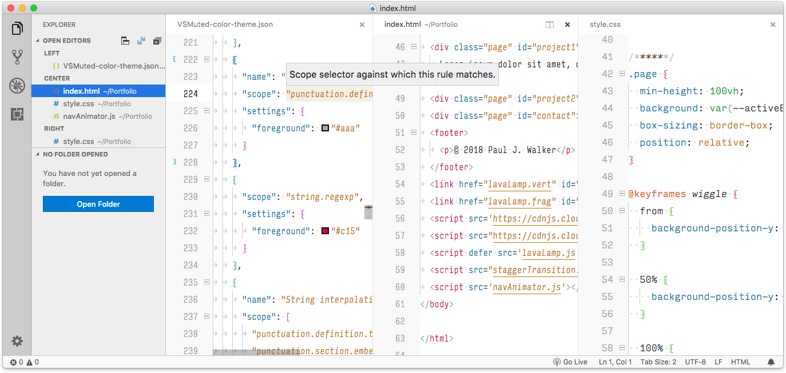

# VS-Muted

A basic light-colored theme, with mostly muted colours and with borders between sections to match macOS styling.

## License

This work is licensed under the [Creative Commons CC0 1.0 Universal License](https://creativecommons.org/publicdomain/zero/1.0/legalcode). Use it as you wish.
